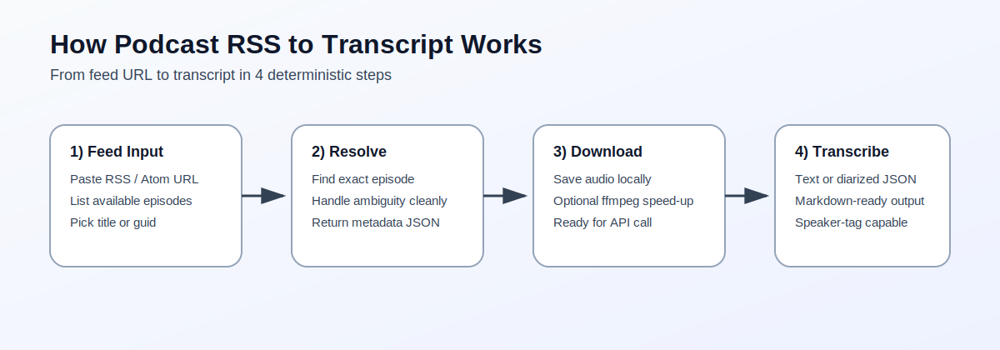
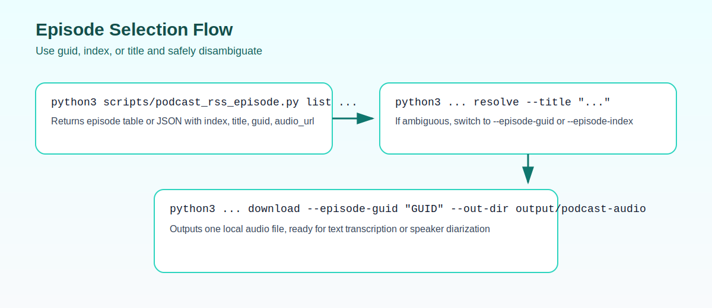
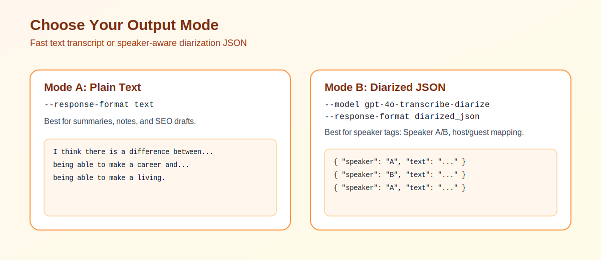

# Podcast RSS to Transcript

Turn any podcast RSS feed into a clean transcript with a repeatable workflow.

This Codex skill helps you:
- Find episodes from RSS/Atom feeds
- Select exactly one episode by title, guid, index, or latest
- Download episode audio locally
- Hand off to transcription (including optional speaker diarization)

## Why this is useful

Most podcast workflows break on episode selection and file handling. This skill gives you a reliable, scriptable path from feed URL to transcript file.

## Visual walkthrough

### 1) End-to-end workflow



### 2) Episode selection and disambiguation



### 3) Output mode options



## What's included

- `SKILL.md` - Skill behavior and workflow
- `agents/openai.yaml` - Codex UI metadata
- `scripts/podcast_rss_episode.py` - RSS listing, episode resolution, and download CLI

## Requirements

- Python 3.9+
- Network access (RSS + audio download + transcription API)
- `OPENAI_API_KEY` for transcription
- Optional: `ffmpeg` for speed adjustment before transcription

## Quick start

1. Clone this repo:

```bash
git clone https://github.com/bluebluegrass/podcast-rss-to-transcript.git
cd podcast-rss-to-transcript
```

2. Make skill available to Codex:

```bash
mkdir -p "$HOME/.codex/skills"
ln -s "$(pwd)" "$HOME/.codex/skills/podcast-rss-transcribe"
```

3. Ensure transcription skill exists and set API key:

```bash
export OPENAI_API_KEY="your_key_here"
```

## End-to-end example

List episodes:

```bash
python3 scripts/podcast_rss_episode.py list \
  --feed-url "https://example.com/podcast.rss" \
  --limit 30
```

Resolve one episode by title:

```bash
python3 scripts/podcast_rss_episode.py resolve \
  --feed-url "https://example.com/podcast.rss" \
  --title "Episode title text"
```

Download the resolved episode:

```bash
python3 scripts/podcast_rss_episode.py download \
  --feed-url "https://example.com/podcast.rss" \
  --episode-guid "episode-guid-here" \
  --out-dir "output/podcast-audio"
```

Transcribe:

```bash
python3 "$HOME/.codex/skills/transcribe/scripts/transcribe_diarize.py" \
  "output/podcast-audio/episode.mp3" \
  --response-format text \
  --out "output/transcribe/episode.md"
```

## Optional: speaker labels

Use diarization when you need speaker tags:

```bash
python3 "$HOME/.codex/skills/transcribe/scripts/transcribe_diarize.py" \
  "output/podcast-audio/episode.mp3" \
  --model gpt-4o-transcribe-diarize \
  --response-format diarized_json \
  --out "output/transcribe/episode.diarized.json"
```

## Tips for best results

- Prefer `--episode-guid` for stable selection.
- If title search matches multiple episodes, use guid or index to disambiguate.
- Avoid aggressive speed-up (3x+) before transcription unless necessary.


## Web app mode

The repository also includes a simple web app in `webapp/`.

- Mode 1: input RSS feed URL + episode title
- Mode 2: input podcast title + episode title (backend feed discovery via iTunes search + cache)

See `webapp/README.md` for run instructions and API details.

## License

MIT (see `LICENSE`)
